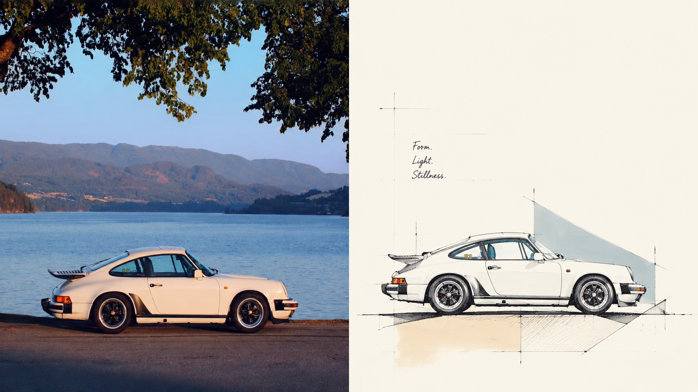
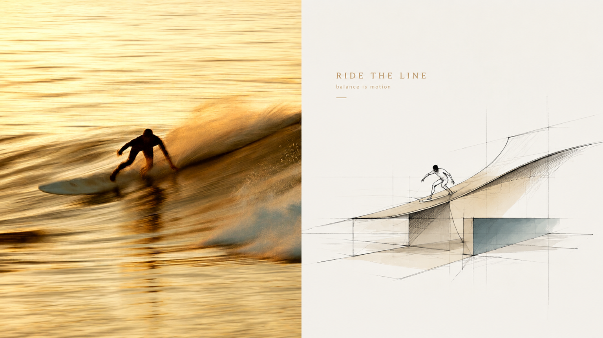
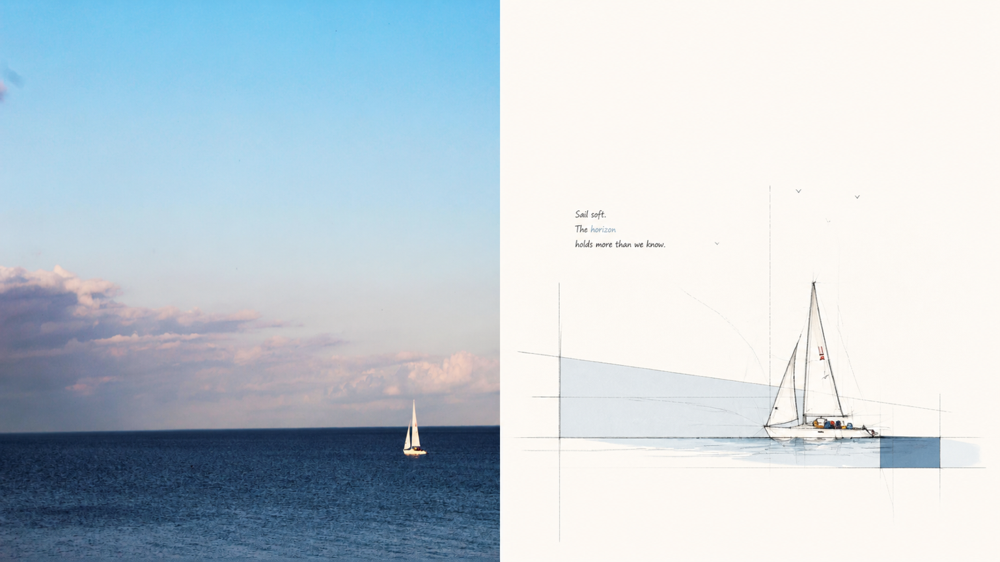
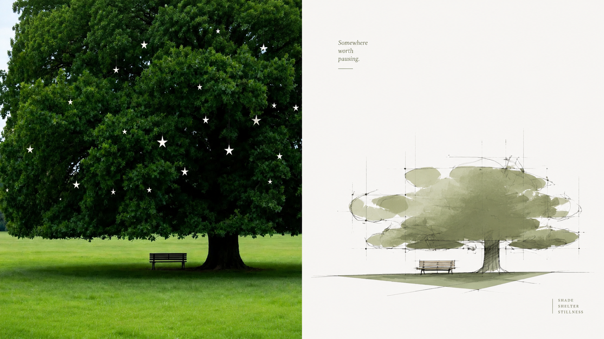
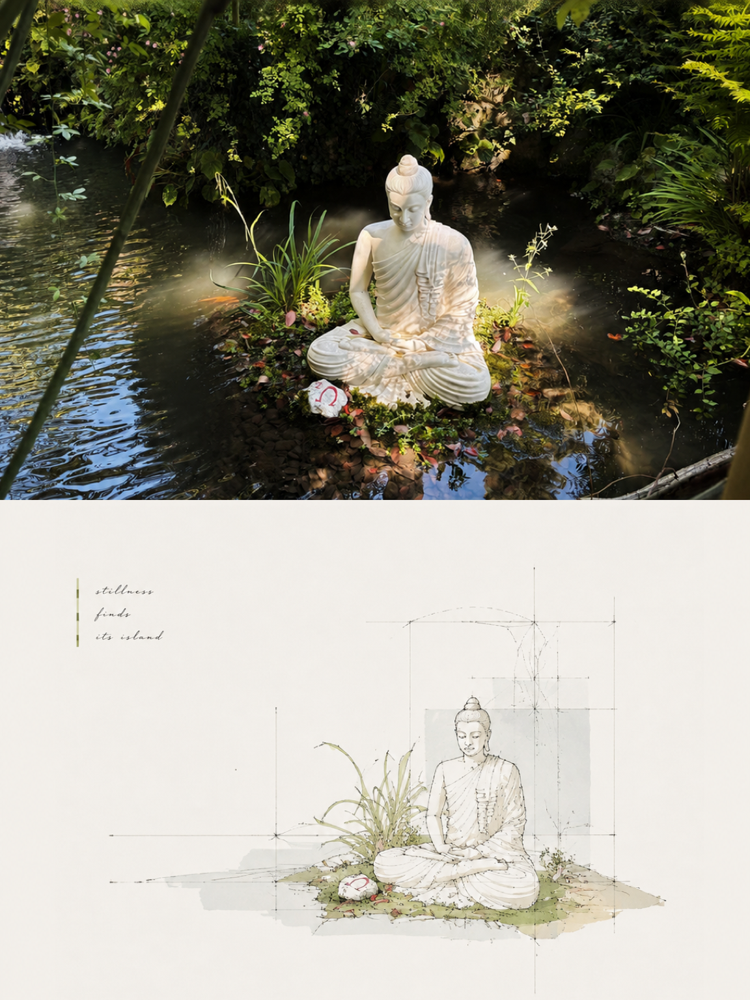
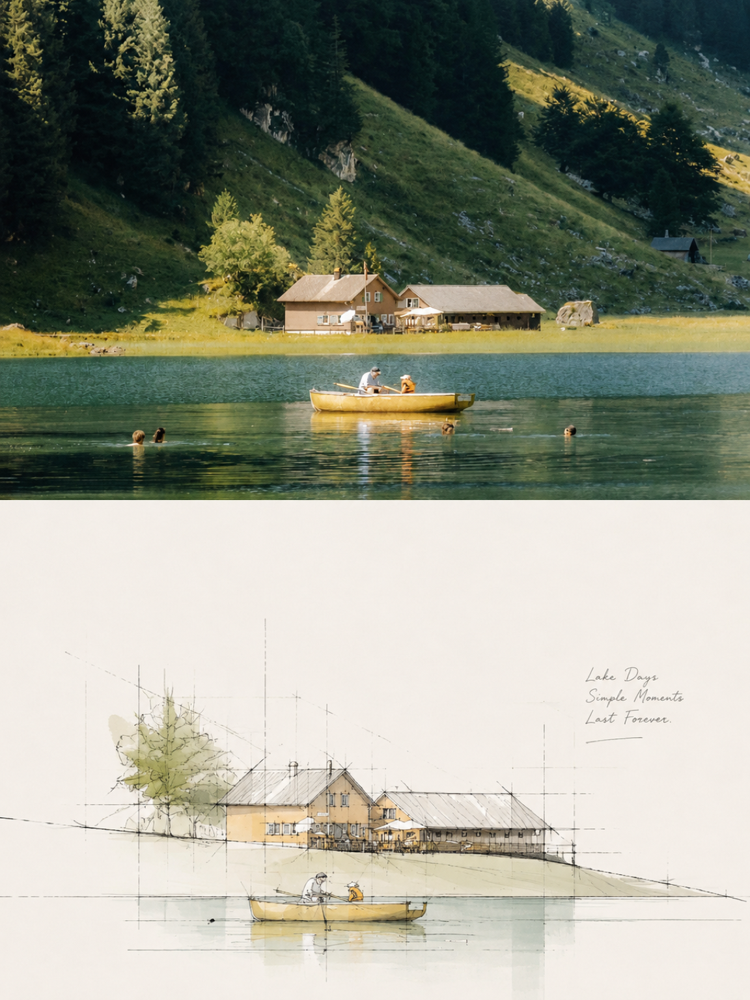
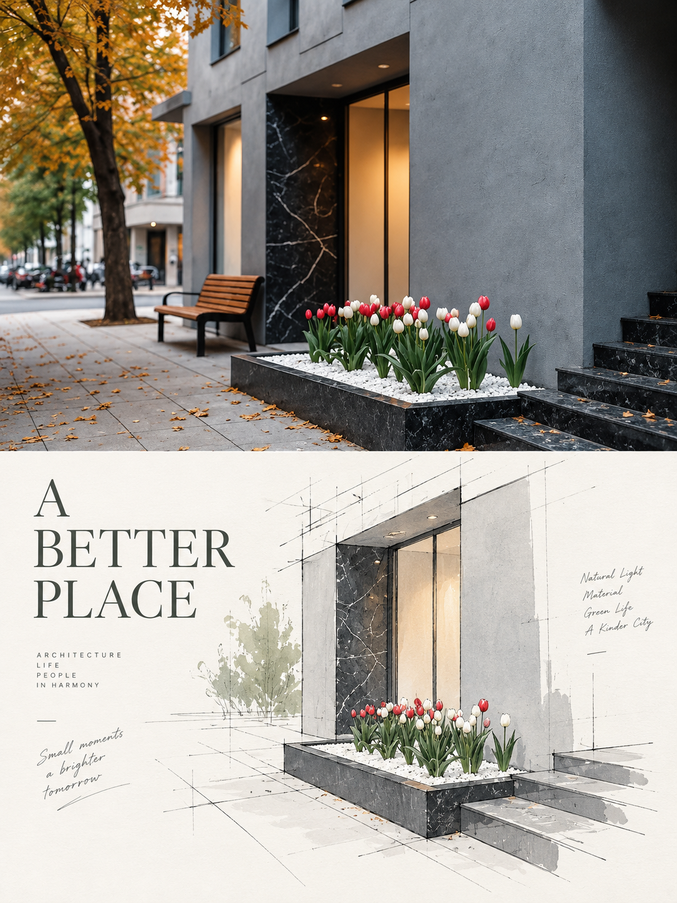

# XXD Panel 120｜Architectural Concept Sketch Chronicle

Turn spatial memories in a photograph into an architectural sketch with room to breathe.

[简体中文](README.md) · [English](README.en.md) · [日本語](README.ja.md) · [한국어](README.ko.md) · [العربية](README.ar.md)

## Sample works

These 8 samples use original references from different directories, independently generated by Panel 120 in one pass with source-grounded English copy. AI metadata is cleaned before publication. Landscape pairs place the photograph left and design right; portrait pairs place the photograph above and design below, each exactly 50%.

**16:9 · left-right · 50:50**

| sample-05 | sample-06 |
|---|---|
|  |  |
|  |  |

**3:4 · top-bottom · 50:50**

| sample-09 | sample-10 |
|---|---|
|  |  |
|  |  |

## Best-fit situations and problems solved

Want a concept drawing that communicates design exploration without tracing an entire photograph? Panel 120 preserves identity and spatial memory while distilling core forms, contours, and relationships into freehand perspective lines. Sparse colour, geometric guides, and extensive whitespace compose the result.

### Best for

- Turning architecture, spaces, travel, or object photography into editorial concept sketches.
- Rescuing weak composition, cluttered backgrounds, or small subjects through subtraction, rearrangement, and scale.
- Preserving recognition and spatial relationships without all-over colour or photorealistic rendering.
- Delivering a consistent style in paired layouts, design-only works, wallpapers, and directory batches.

### What it solves

- Removes background and secondary objects to preserve core forms and visual memory.
- Uses relaxed, restrained, slightly repeated perspective and construction lines to express design exploration.
- Makes whitespace an active part of composition instead of filling the page with decoration.
- Keeps comparisons to exactly two equal regions and generates each original independently without a second stylisation.

## Original prompt · five languages

[简体中文](references/original-prompt/zh-CN.md) · [English](references/original-prompt/en.md) · [日本語](references/original-prompt/ja.md) · [한국어](references/original-prompt/ko.md) · [العربية](references/original-prompt/ar.md)

The Chinese file preserves the user's source verbatim and is the sole runtime creative and aesthetic authority. The other versions are complete faithful reading translations.

architectural concept perspective sketch · freehand linework · geometric guides · sparse colour and shadows · 2–4 source-derived colours · extensive whitespace · minimal editorial notes

## Transformation logic

recognise theme and spatial relationships → distil core forms → remove complex background → recompose scale and crop → rebuild with perspective lines, geometric guides, and sparse colour → finish with whitespace and short notes

## Recognisable finished traits

- The photograph remains above or left with only subtle grading and unchanged subject identity and pose.
- The design is an architectural concept drawing, not full-scene tracing, photorealistic visualisation, or 3D.
- A small distilled subject can sit off-centre, near an edge, or partly cropped; whitespace actively composes the page.
- 2–4 source colours form a clean, restrained palette, applied lightly only to key areas.
- Geometric shadows convey volume and depth; a few guides retain a sense of design exploration.
- Very sparse text rests quietly in whitespace without a fixed type template; samples use English.

The selected delivery mode remaps layout only, without altering the source aesthetics: `left-right` maps the upper photograph to the left and the lower design to the right. The selected ratio overrides the source default `3:4`.

## Four output modes

- `top-bottom`: exactly two full-width regions, reality above and design below, 50% each.
- `left-right`: exactly two full-height regions, reality left and design right, 50% each; it never rotates into a top-bottom layout.
- `design-only`: the full canvas contains only Panel 120's designed translation; the photograph remains a non-visible reference.
- `wallpaper-pack`: creates complete artworks for phone, iPad, desktop, and watch, either `linked` as a coherent family or `independent` as four separate works.

Modes and sizes may be combined. Supported sizes include `1:1`, `3:4`, `4:3`, `4:5`, `5:4`, `2:3`, `3:2`, `9:16`, `16:9`, `21:9`, `5:7`, `7:5`, and exact pixels. Text can be prompt-generated, user-exact, or absent. A directory is inventoried recursively and every source is isolated while sharing one set of delivery settings; final PNG files remain flat in one fresh task directory.

## Getting started

```bash
git clone https://github.com/nevertoday/xxd-panel-120.git
npx skills add https://github.com/nevertoday/xxd-panel-120 --skill xxd-panel-120
```

Restart the agent session after installation, then invoke `$xxd-panel-120`. Add `--global --agent codex --yes` when a user-level Codex installation is wanted.

Common examples:

```text
/xxd-panel-120 photo.jpg --mode top-bottom --size 3:4 --text prompt --locale en-US
/xxd-panel-120 photo.jpg --mode left-right --size 16:9 --text prompt --locale en-US
/xxd-panel-120 photo.jpg --mode design-only --size 9:16 --text none
/xxd-panel-120 ./photos --mode design-only --size auto,3:4 --text prompt --locale ja-JP
```

See [SKILL.md](SKILL.md) for the full runtime contract and the [English](references/xxd-panel-120-prompt.en.md) or [Chinese](references/xxd-panel-120-prompt.zh-CN.md) runtime adapter.

<!-- xxd-readme-ads:start -->
## About XXD

XXD is Xiaoxiaodong's abbreviated brand name. Created and maintained by [@xiaoxiaodong01](https://x.com/xiaoxiaodong01).

## Support and membership

> **Advertising disclosure:** QR codes and paid membership/service links in this section are XXD promotional content. Scanning or purchasing is optional and does not affect access to this open-source project.

### Xiaoxiaodong Commander · General Command Skill · CNY 100

A one-time CNY 100 purchase unlocks this suite's General Command Skill (`xxd-panel-all`) for roster control, recommendations, Soldier dispatch, and batch coordination. Include “General Command Skill” in your WeChat message.

<!-- xxd-panel-command-system:start -->
**Your purchase unlocks the General Skill that commands the whole roster**

| Level | Skill | Responsibility |
|---|---|---|
| **General** | [`xxd-panel-all`](https://github.com/xiaoxiaodong-ai/xxd-panel-all) | Detect available numbered Skills; recommend by image, theme, or use; dispatch a chosen number; organize multi-style trials; and assign folders of images to individual jobs. |
| **Soldiers** | `xxd-panel-NNN` | Each numbered Skill executes only its own original brief and aesthetic, completing the individual job assigned by the General. |

The General Skill is the command center for the entire numbered-Skill roster. Your purchase unlocks it together with help for installation, updates, roster setup, and dispatch workflows. The General organizes and routes; it never rewrites, blends, or overrides a Soldier's original aesthetic. Every finished asset is still created independently by the selected Soldier Skill.
<!-- xxd-panel-command-system:end -->

### Knowledge Planet + Member Prompt Library + All General Skills Membership · CNY 699/year

[Knowledge Planet](https://wx.zsxq.com/group/15554814142882), the [XXD Member Prompt Library](https://vip.xiaoxiaodong.ai/), and membership for all General Skills are one membership: **one annual payment unlocks all three benefits, with no second purchase required.**

[Knowledge Planet](https://wx.zsxq.com/group/15554814142882) · [Member Prompt Library](https://vip.xiaoxiaodong.ai/)

<p align="center"><a href="https://xiaoxiaodong.pages.dev/assets/wechat-qr.png"></a></p>

---

<div align="center">

## Support this open-source project

If this project helps you, you’re welcome to support it through Buy Me a Coffee—entirely optional.

<p align="center"><a href="https://github.com/nevertoday/zhongguo-traditional-colors/blob/main/docs/images/buy-me-a-coffee-qr.png?raw=true"></a></p>

</div>
<!-- xxd-readme-ads:end -->

## License

This project—including the Skill, prompts, scripts, documentation, and accompanying sample images—is licensed under the **PolyForm Noncommercial License 1.0.0**. See [LICENSE](LICENSE) for the full legal text and <https://polyformproject.org/licenses/noncommercial/1.0.0> for the official page.

In plain language:

- Individuals may use it for study, research, experimentation, testing, hobby projects, and private entertainment. Charities, educational institutions, public research, safety or health organisations, environmental organisations, and government institutions may also use it.
- For **noncommercial purposes**, you may use, copy, modify, create derivative works, and share it. When sharing, you must also provide this license (or the link above) and every `Required Notice:` statement supplied by the author.
- It may not be used in commercial products or services, paid delivery, sale of access or licences, or any use expected to lead to commercial application. Obtain separate written permission from the copyright holder before commercial use.
- The agreement grants only the copyright licence and limited patent licence expressly stated. It grants no trademarks, brand names, or other unstated rights, and you may not sublicense your licence to others.
- After written notice of a violation, you must return to compliance and take practical remedial steps within 32 days, or the licences terminate immediately. A written patent-infringement claim also terminates the patent licence.
- The material is provided “as is”, without warranty to the extent permitted by law. Users bear the risks and potential losses arising from its use.
